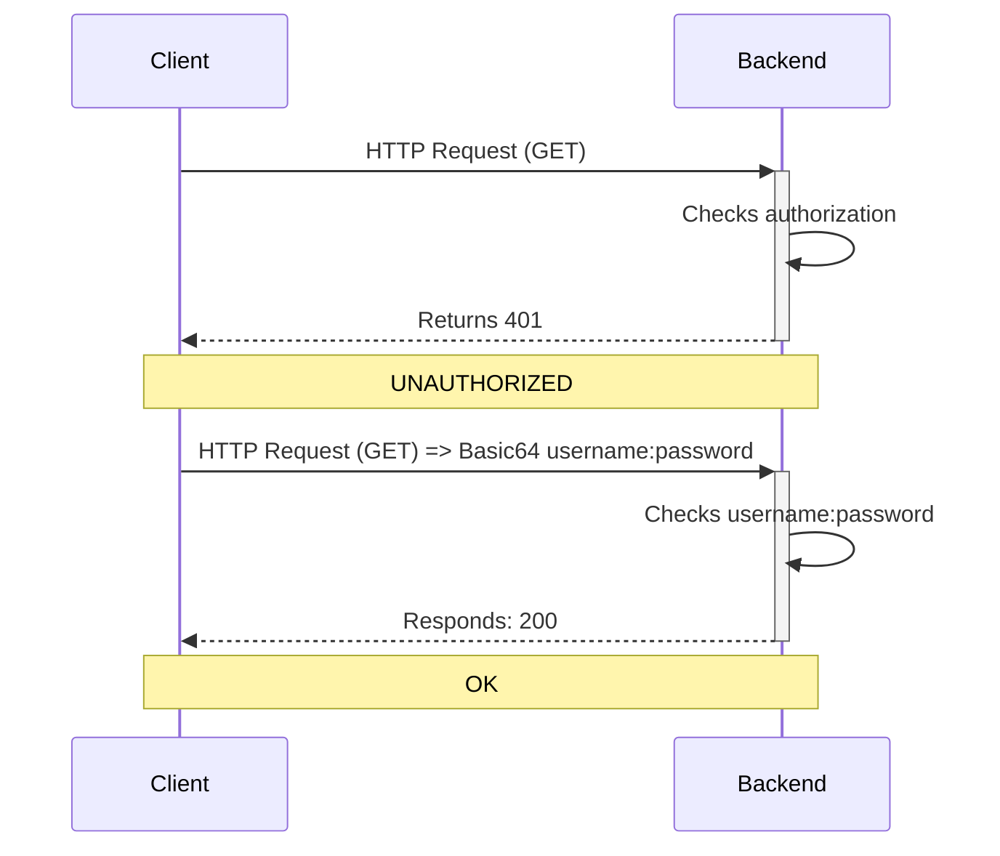

# `spring-boot-security-example`

---
## 🚀Quickstart

### What's included?

![shield-springboot][shield-springboot]
![shield-java][shield-java]
![shield-kotlin][shield-kotlin]
![shield-gradle][shield-gradle]

### 🧰Prerequisite(s)
- Intellij Idea CE
- Postman

## Basic Auth.



## `curl` 호출 테스트

### Basic Auth.

#### ⚠️`401` Unauthorized

_로그인 인증 없이_ 호출 했을 시 `401 Unauthorized` 응답결과 나오는지 확인

```sh
curl http://localhost:8080/api/v1/greetings
```

#### ✅ `200` Ok

로그인 인증결과로 Basic Auth처리 후 호출 했을 시 `200 Ok` 응답결과가 나오는지 확인

(예를들어) 인증결과는 스프링 부트 후 로그에 아래와 같이 기록된다.
```
...
Using generated security password: 7dd436e6-1c3d-4dde-b09a-cb648b1fa400
...
```

```sh
curl http://localhost:8080/api/v1/greetings -u "user:7dd436e6-1c3d-4dde-b09a-cb648b1fa400"
```

---
## ✅Task(s) Completed
- [x] ~~initialize project~~
- [x] ~~Bootstrap app~~
- [x] ~~Create API~~
- [x] ~~Install Spring Security~~
- [x] ~~Implement basic authentication~~
- [ ] Implement JWT authentication filter
- [ ] Implement JWT utils class and finalize the filter
- [ ] Tell Spring to use the JWT filter
- [ ] Implement `userDetailsService`
- [ ] Add the `authenticationProvider` bean
- [ ] Add session management creation policy
- [ ] Implement Authentication controller
- [ ] Improve the code
- [ ] Testing the application

---
## 📚References

- [Spring Security Tutorial - [NEW] [2022] | Amigoscode][youtube-tut]


[shield-springboot]: https://img.shields.io/badge/springboot-2.7.6-6DB33F?logo=springboot&logoColor=6DB33F&style=flat-square
[shield-java]: https://img.shields.io/badge/Java-17-f3812a?logo=java&logoColor=f3812a&style=flat-square
[shield-kotlin]: https://img.shields.io/badge/Kotlin-1.6.21-0095D5?logo=kotlin&logoColor=0095D5&style=flat-square
[shield-gradle]: https://img.shields.io/badge/Gradle-7.5.1-abd759?logo=gradle&logoColor=abd759&style=flat-square
[youtube-tut]: https://www.youtube.com/watch?v=b9O9NI-RJ3o
